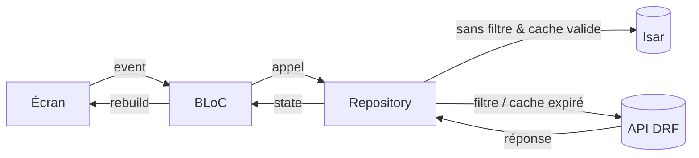

# Architecture

Ce document décrit l'architecture technique de **Gestion Paroissiale**.

## Vue d'ensemble

L'application suit une **Clean Architecture** à trois couches, avec une séparation stricte des responsabilités :

```
┌─────────────────────────────────────────────┐
│                presentation                  │  UI + état (BLoC)
│      screens/ · widgets/ · blocs/            │
└──────────────────────┬──────────────────────┘
                       │ events / states
┌──────────────────────┴──────────────────────┐
│                    data                      │  Accès aux données
│        repositories/ · models/               │
└──────────────────────┬──────────────────────┘
                       │ API REST / cache
┌──────────────────────┴──────────────────────┐
│                    core                      │  Infrastructure
│  network · database · sync · router · di …   │
└─────────────────────────────────────────────┘
```

## Couche `core` (`lib/core`)

Infrastructure et configuration transverse :

- **`constants/`** — endpoints et constantes (`api_constants.dart`).
- **`di/`** — injection de dépendances avec GetIt (`injection.dart`).
- **`network/`** — client HTTP Dio et gestion des exceptions (`dio_client.dart`, `api_exception.dart`).
- **`router/`** — configuration GoRouter, routes imbriquées et gardes.
- **`theme/`** — thème Material (`app_theme.dart`, clair/sombre adaptatif).
- **`storage/`** — `SecureStorage` (jetons JWT) et `FileStorageService` (cache de fichiers sur disque).
- **`database/`** — cache local Isar (`isar_plus`).
- **`sync/`** — synchronisation en arrière-plan.
- **`auth/`** — permissions basées sur les rôles (`permissions.dart`).
- **`utils/`** — utilitaires (ex. génération d'UUID côté client).

## Couche `data` (`lib/data`)

Responsable de la communication API et de la modélisation :

- **`models/`** — modèles JSON sérialisables : `AuthUser`, `Membre`, `Groupe`, `Evenement`, `Transaction`, `Article`, `Vente`, `Sacrement`, `Activity`.
- **`repositories/`** — abstraction des sources de données : `auth`, `membre`, `groupe`, `evenement`, `finance`, `librairie`. Chaque repository appelle l'API via `DioClient` et gère le cache.

## Couche `presentation` (`lib/presentation`)

UI et gestion d'état :

- **`blocs/`** — 7 BLoCs principaux : `AuthBloc`, `MembresBloc`, `GroupesBloc`, `EvenementsBloc`, `FinancesBloc`, `LibrairieBloc`, `DashboardBloc`.
- **`screens/`** — écrans par fonctionnalité (`auth`, `dashboard`, `membres`, `groupes`, `evenements`, `finances`, `librairie`, `profile`, `splash`), avec navigation imbriquée.
- **`widgets/`** — composants réutilisables (`MainLayout`, `AppDrawer`, `StatCard`, etc.).

## Gestion d'état (pattern BLoC)

Chaque fonctionnalité suit le même schéma événementiel :

```dart
abstract class FeatureEvent extends Equatable {}
abstract class FeatureState extends Equatable {}

class FeatureBloc extends Bloc<FeatureEvent, FeatureState> {
  final FeatureRepository repository;
  FeatureBloc({required this.repository}) : super(FeatureInitial()) {
    on<FeatureRequested>(_onRequested);
  }
}
```

Les événements et états utilisent `Equatable` (tous les champs dans `props`) pour l'égalité de valeur.

## Injection de dépendances

Tout est enregistré dans `lib/core/di/injection.dart` :

- Les **repositories** sont des singletons paresseux (`lazy singletons`).
- Les **BLoCs** sont des factories (nouvelle instance par écran), sauf `AuthBloc` (singleton).
- `DioClient` et `SecureStorage` sont des singletons paresseux.
- Récupération via `sl<ClassName>()`.

## Navigation & routage

**GoRouter** avec routes imbriquées (`ShellRoute` pour les écrans authentifiés). `AppRouter.redirect()` applique deux règles :

1. **Authentification** — un utilisateur non authentifié est redirigé vers `/login`.
2. **Autorisation par rôle** — une section inaccessible redirige vers `landingRoute`.

## Autorisation basée sur les rôles

Source de vérité unique : **`lib/core/auth/permissions.dart`** (`AppPermissions`), construite depuis le `role` de l'utilisateur courant. Elle **reflète les classes de permissions du backend** (`IsSecretaryOrAbove` / `IsTreasurerOrAbove` / `IsAdmin`).

Hiérarchie des rôles :

| Rôle | Niveau |
| --- | --- |
| `fidele` | Utilisateur authentifié de base |
| `secretaire` | Secrétaire (et au-dessus) |
| `responsable` | Responsable de groupe |
| `tresorier` | Trésorier (accès finances) |
| `pretre` | Prêtre |
| `admin` | Administrateur (tous droits, suppressions) |

Lecture dans les widgets via `context.perms` (dans `build` uniquement). Les getters (`canManageMembres`, `canViewFinances`, `canDeleteGroupes`, …) gardent les FAB, boutons d'édition et de suppression.

## Réseau & API

- Client `DioClient` (`lib/core/network/dio_client.dart`) : ajout automatique du header `Authorization`, rafraîchissement transparent du jeton sur `401`, interceptors, parsing des exceptions.
- Enveloppe de réponse : `{ success, data, error?, message? }`.
- Identifiants : **UUID (String)** sur toutes les entités.

Voir [`api.md`](api.md) et [`database.md`](database.md) pour les détails réseau et cache.

## Diagramme de flux d'une requête


